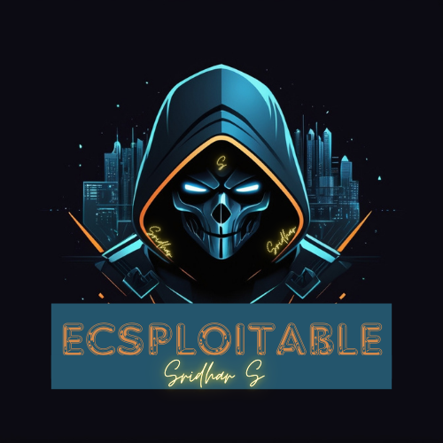

# Ecsploitable -by Sridhar S   [ Disclaimer ](https://drive.google.com/file/d/1DaX_Rm4t4WAPNj-qZgWHLAv30xu4QQDD/view?usp=sharing)   [ UsageGuidelines ](https://drive.google.com/file/d/1mSjTNZeezXlH2ESt1y6EFD71HKbcgi8c/view?usp=sharing)

Ecsploitable is a deliberately vulnerable virtual machine designed for security researchers and ethical hackers to practice penetration testing. This preconfigured VM offers a safe environment to explore vulnerabilities and develop exploitation skills.  

A Private Lab Environment for Learning & Practicing EthicalHacking that Match RealWorld Scenerios, In a Safe Environment [using NAT or Host-Only Adaptor]

Ecsploitablewin   - Based on Windows8.1

Ecsploitableubntu - Based on Ubuntu (Lightweight)

## Features  
- Preconfigured virtual machine for penetration testing.  
- Simulates real-world vulnerabilities such as SQL Injection, XSS, buffer overflows, and more.  
- Easy to set up—just extract the file and attach it to your virtualization software.  
- Supports popular tools like Metasploit, Burp Suite, and more.  

## Installation  

1. *Download the Virtual Machine*  
   - [Download Link](./path-to-vm-file)  

2. *Extract the VM*  
   Extract the downloaded file using a tool like 7-Zip or WinRAR.  

3. *Import into Virtualization Software*  
   - Open your virtualization software (e.g., VirtualBox or VMware).  
   - Import the VM file (.ova or .vmdk) as a new virtual machine.  

4. *Start the VM*  
   - Launch the virtual machine.  
   - Use the credentials provided below to log in.  

## Default Credentials  
- Username: ecadmin  
- Password: password  
  
## Disclaimer  
This project is intended for educational purposes only. Use it in a controlled environment and ensure you comply with all applicable laws.  

## License  
This project is licensed under the MIT License. See the [LICENSE](./LICENSE) file for details.  

## Support  

If you found this project useful, please consider donating by:  

*UPI ID:* your-upi-id@upi  

Thank you for your support!  

---

Happy Hacking!
